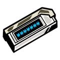

# PrescriptBeeper

**A fan-made Android notification system inspired by the Index's Prescript Beeper from *Limbus Company***

---

## Introduction

PrescriptBeeper turns ordinary phone events (texts, calls, calendar events, low battery, low earbuds battery) into stylized, full-screen **"Prescripts"**, mimicking the in-universe Index device from *Limbus Company*. Instead of a normal Android notification, you get a floating popup with a scramble-to-reveal text animation, a custom beep, and an Accept/Dismiss choice, styled after the device's cyan-on-black display.

  
   
  <em>"The waves are lonely"</em>

This started as a first-ever Kotlin project, built entirely feature-by-feature — see [Tech Notes](#tech-notes--hyperos-quirks) for the Android/HyperOS-specific issues solved along the way.

---

## Features

### 🔔 The Prescript Popup
- Full-screen floating overlay (draws over any app, not just the lock screen)
- Character-scramble reveal animation before the final line is revealed
- Custom beep sound, with an in-app volume slider
- Configurable auto-dismiss timer with a live countdown badge top right
- Shows the sending app's icon + sender name for messages/calls
- Accept opens the app the notification was sent from directly; Dismiss just closes it
- A footer that tracks daily completions and displays your current **Unlock Stage** (1–3), resetting at midnight
- Daily Reminders with custom messages

### 📡 Real-World Triggers
- **Messages & Calls** - via notification listening, fully configurable per app
- **Calendar** - a daily check against your phone's synced Google Calendar, once each morning
- **Phone Battery** - low-battery and restored-battery alerts, both thresholds adjustable
- **Bluetooth Earbuds/Headphones** - low-battery alerts for *any* connected Bluetooth audio device
- Per-app cooldowns and duplicate-notification protection, so one message never spams multiple popups

### 🗂️ App Categories & Exclusions
- Assign any installed app to **Messages/Calls** or **Calendar**, or leave it untouched (doesn't trigger the popup)
- **Exclusions** - mark specific apps (games, sensitive apps, etc.) to be silently tracked with a small on-screen flower badge, with no popup or sound at all
- Both screens support live search across every installed app

### 📊 Stats & History
- **Prescript Log** - the last 20 "prescripts" (notifications), with real notification content, sender, and outcome (Accepted / Dismissed / Expired)
- **Stats** - Day, Week, and Month views with a custom bar chart, busiest-day tracking, and a category breakdown
- **Home Screen Widget** - today's completion count and current stage (Unlock 1/2/3)

### ⚙️ Fully Configurable
- Editable prescript line pools per category - add or remove your own custom lines anytime
- Adjustable volume, popup duration, per-app cooldown, and battery thresholds
- A single switch to pause the entire system without uninstalling anything

---

## Setup

1. Download the APK from [Releases](../../releases)
2. Tap the file on your Android phone (no iPhone release) and approve the one-time "install from this source" prompt (if it appears)
3. Open the app and walk through the **Permissions** screen (in Setup & Testing):
   - Notification Access
   - Display Over Other Apps
   - Calendar Access
   - Bluetooth & Notifications (requested automatically)
   - Disable Battery Restriciton
   - Enable Autostart
4. Head into "Configurations" -> "App Categories" and select which apps you want the Prescript popup to trigger on

### A note for Xiaomi/HyperOS devices
Several permissions on MIUI/HyperOS are hidden behind extra manufacturer-specific toggles beyond stock Android's settings. If popups aren't appearing, check:
- **Autostart** permission for the app
- **Display pop-up windows while running in the background**
- **Battery saver** set to "No restrictions" for this app

  
   
  <em>"So simple! What a great job I did...right?"</em>

---

## Tech Notes / HyperOS Quirks

This project intentionally avoids two "expected" approaches that turned out to be unreliable on real hardware:

- **Full-screen intent notifications** (the usual way to show a popup over the lock screen) were silently blocked by HyperOS's internal allowlist. The app uses a `WindowManager` overlay service instead, which works regardless of OEM restrictions.
- **`ACTION_BATTERY_LOW`** is a fixed, OS-defined threshold (~15%, not adjustable). Battery monitoring instead reads the live percentage directly and compares it to a user-set threshold.

---

## Disclaimer

This is an unofficial, non-commercial fan project inspired by *Limbus Company*, created by Project Moon. All game-related names, concepts, and imagery referenced belong to their respective owners. PrescriptBeeper is a personal utility app and is not affiliated with or endorsed by Project Moon.

  
   
  <em>"_THE INDEX AWAITS YOUR PARTICIPATION._"</em>

